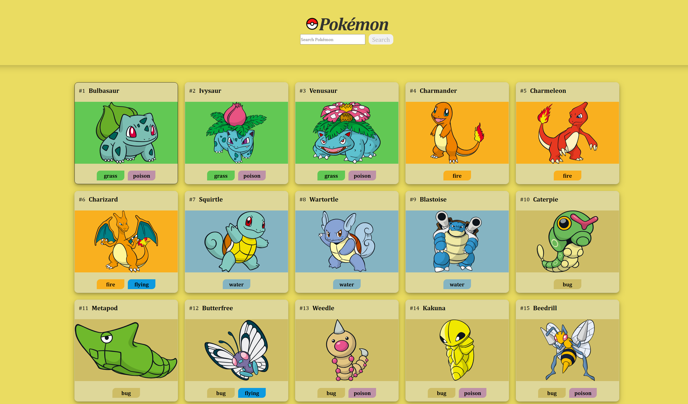

# Pokédex

Eine interaktive Pokédex-Webanwendung, mit der Pokémon geladen, durchsucht und detailliert angezeigt werden können.

Die Anwendung verwendet die [PokéAPI](https://pokeapi.co/), um Pokémon-Daten wie Bilder, Typen, Fähigkeiten, Statuswerte und Entwicklungsketten abzurufen.

## Vorschau



## Features

- Anzeige von Pokémon-Karten
- Laden weiterer Pokémon in 20er-Schritten
- Suche nach bereits geladenen Pokémon
- Detailansicht für jedes Pokémon
- Anzeige von:
  - Pokémon-Name
  - Pokémon-ID
  - Typen
  - Größe und Gewicht
  - Fähigkeiten
  - Statuswerten
  - Entwicklungskette
- Navigation zwischen Pokémon in der Detailansicht
- Ladeanimation während API-Anfragen
- Responsive Darstellung für Desktop- und Mobilgeräte
- Typabhängige Farben für Pokémon-Karten

## Verwendete Technologien

- HTML5
- CSS3
- JavaScript
- PokéAPI

## Projektstruktur

```text
pokedex/
├── assets/
│   └── icons/
├── scripts/
│   └── template.js
├── styles/
│   ├── dialog.css
│   ├── dialog-tabs.css
│   └── pokemon-colors.css
├── index.html
├── script.js
├── style.css
└── README.md
`````` 


## Installation 

### Repository klonen
````
git clone https://github.com/KarloHlisc/pokedex.git
cd pokedex
````

### Anwendung starten
Da die Anwendung Daten über ``fetch()`` von der PokéAPI lädt, sollte sie über einen lokalen Webserver gestartet werden.

#### Möglichkeit mit VS Code Live Server
1. Öffne das Projekt in Visual Studio Code.
2. Installiere die Erweiterung Live Server.
3. Klicke mit der rechten Maustaste auf ``index.html``.
4. Wähle Open with Live Server.
